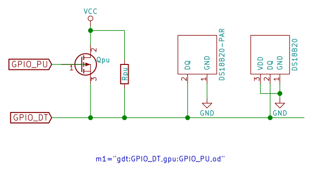
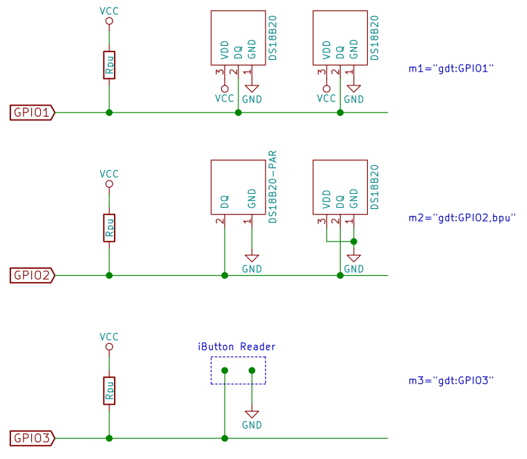

w1-gpio-cl
==========

This is a Linux kernel-mode driver, intended as an enhancement/substitution
of the standard Linux `w1-gpio` 1-wire bus master driver. Contrary to
the standard driver, `w1-gpio-cl` is not a platform device driver, therefore
doesn't need any specific device-tree overlay nor preconfigured kernel (except
usual 1-wire support via the `wire` module). Moreover, there is possible
coexistence between `w1-gpio` and `w1-gpio-cl`, provided no GPIOs conflict
exists.

Module configuration
--------------------

`w1-gpio-cl` is fully configured via its command line arguments while loading
the driver. The configuration allows to launch many 1-wire bus masters
controlling different GPIO pins. For parasite powering support, there is
possible to choose a type of the strong pull-up to be used.

General configuration syntax is:

    insmod w1-gpi-cl.ko m1="gdt=num[,od][,bpu|gpu=num[,rev]]" [m2="..." ...]

where:

* `m1`, `m2`, ... `mN` - configure up to N (where N=5 for the standard module
  compilation) bus masters, each one controlling different 1-wire bus connected
  to its GPIO pin (specified in `gdt`). At least one bus master specification
  (that is `m1`) must be provided.

  It's worth to note, the `X` index in `mX` parameter specifies an order in
  which bus masters are registered in the 1-wire subsystem. The index doesn't
  need to correspond to the bus master id assigned by the kernel.

Each of bus master configurations consist of set of parameters listed below:

* `gdt` - specifies GPIO number associated with the 1-wire data wire (the
  1-wire bus). This parameter is obligatory for each bus master specification.

* `od` - if specified, the data wire GPIO (`gdt`) is of an open drain type.

* `bpu` - if specified, parasite powering is enabled via the data wire strong
  pull-up bit-banging. This type of strong pull-up is possible only for non
  open-drain type of the data wire GPIO (`gdt`).

* `gpu` - specifies GPIO number used for controlling strong pull-up for
  parasite powering. The GPIO is working in the output mode and is set to the
  low state if the strong pull-up is active, and to the high state otherwise.

  The strong pull-up controlled by the `gpu` GPIO is the only possibility for
  an open-drain type of the data wire GPIO (`gdt`). In this case the `gpu` GPIO
  may be connected to a P-channel MOSFET gate controlling the `Vcc` strong
  pull-up as presented on the following figure.

  

  NOTE: In place of the MOSFET there is possible to use a PNP bipolar transistor
  with its emitter connected to the data wire, collector to `Vcc` and base to
  the controlling GPIO (`gpu`).

* `rev` - if specified and the `gpu` parameter is provided, the `gpu` GPIO
  logic is reversed for the strong pull-up activation: GPIO in the high state
  if the strong pull-up is active, low state - otherwise.

Example of usage
----------------

In this example, there have been configured three bus masters:

* 1st one on GPIO1 controlling non-parasitically powered thermometers.

* 2nd one on GPIO2 controlling parasitically powered thermometers. Strong
  pull-up is performed via the data wire bit-banging (non open-drain data GPIO).

* 3nd one devoted to handle iButton reader(s) only. Using separate 1-wire bus
  in this case is justified by the performance reason. The iButton bus is empty
  for most of its time, and is scanned/searched much more often than other
  buses for presence of authorized iButtons existence.

Compilation and loading
-----------------------

**Prerequisites**

* Standard Linux kernel building toolset: `gcc`, GNU Make, `bc` etc.

* Kernel headers and `kbuild` scripts corresponding to the target kernel.

  There is also possible to indicate a target kernel source tree by setting
  `KERNEL_SRC` for the project `Makefile`. This is especially useful for the
  module cross-compilation, in which case there is also a need to set `ARCH`
  and `CROSS_COMPILE` to their proper values.

**Pre-build configuration**

By default the module is compiled to support up to 5 bus masters. This may be
changed by setting `CONFIG_W1_MAST_MAX` for the project `Makefile`. For example:

    CONFIG_W1_MAST_MAX=10 make

will compile the driver with up to 10 bus masters support.

**Compilation**

    make

The result is `w1-gpio-cl.ko` driver module located in the project directory.

**Loading**

`w1-gpio-cl` module depends on the `wire` Linux module, therefore it must be
loaded at first. To load the compiled module submit from the project directory:

    modprobe wire
    insmod ./w1-gpio-cl.ko <configuration>

where the `configuration` part specifies 1-wire bus master(s) configuration as
described above.

License
-------

GNU GENERAL PUBLIC LICENSE v2. See LICENSE file for details.
